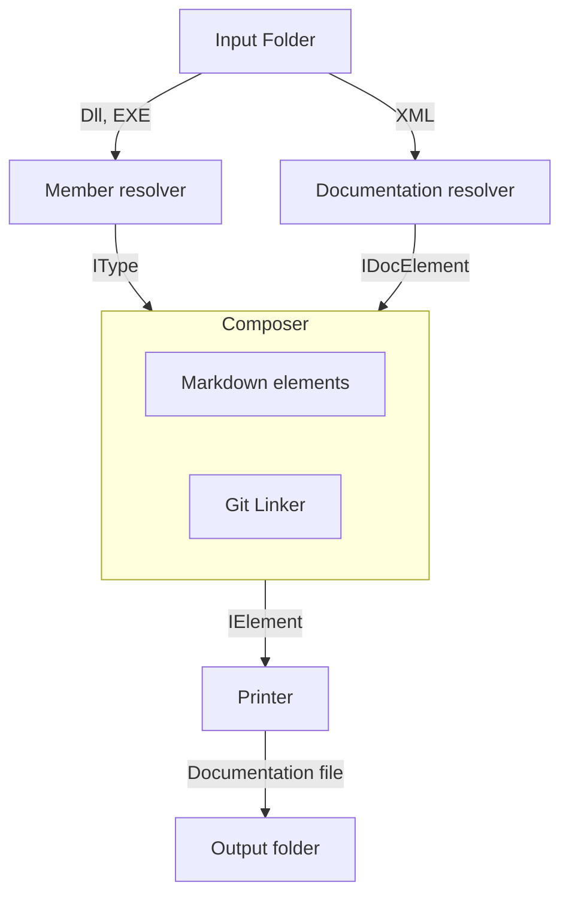

   

# MarkDoc.Core
Markdown documentation generator for .NET libraries written in C# 9 and lower.

Additional details and a list of supported versions of .NET frameworks will be provided later.

In the current project state, the `Members` library is considered stable with 95% test coverage and can be used as a reflection library outside of this project that makes exploring assembly types much easier thanks a higher level of abstraction.
The `Documentation` library is still to be tested and is considered to be unstable; nevertheless, the manual tests proved that most common assemblies will have their documentation parsed correctly.
The biggest task, aside from testing all of the core libraries, is to create a modular UI that is, preferably, cross-platform.

Like this project idea and would like to see it grow? Give it a star and follow for the latest updates.

[I'm writing a Bachelor's thesis about this project](https://github.com/hailstorm75/MarkDoc.Thesis).

## Produced result

This is my second attempt at creating such a tool. The first one is on [GitLab](https://gitlab.com/hailstorm75/markdoc). You can try it out for your self; however, it only supports .NET Framework libraries with NO DEPENDENCIES.

The result which it produces can be seen in the [Wiki](https://github.com/hailstorm75/MarkDoc.Core/wiki) or the repository [source code](https://github.com/hailstorm75/MarkDoc.Core/tree/unstable/sourceWiki)

The generated structure is inspired by the one outputted by Doxygen. If you do not like it, you can always create your own - everything is modular and you can swap out components, libraries, create new plugins... 
Detailed instructions on how to do exactly that are still to be written; however, you can explore the current implementation of the GitMarkdown plugin as a reference for your own project.

## Preview

## Running it

> It has been discovered, that running the application via the `dotnet cli` results in a crash due to incorrect loading of plugins. So, for now, please use Rider/VS20**

 1. Run the MarkDoc.App
 2. Select the available plugin
 3. Provide paths to assemblies
 4. Navigate to the next step and validate whether all of your assemblies have their corresponding documentation files
 5. Navigate to the next step and select your target **Git** hosting platform
 6. Navigate to the next step and provide a path to a folder for output, optionally deselect namespaces/types to skip them
 7. Navigate to the next step and press execute (subject to change)

Run it at your own risk, the code is still under development.

## Performance

Comparison of MarkDoc to Doxygen *v1.9.5* and DocFX *v2.59.4*. Each tool was run four times on Windows OS via Windows PowerShell through the `Measure-Command` script block.

| Run           | MarkDoc     | Doxygen     | DocFX        |
| ------------- | ----------- | ----------- | ------------ |
| 1             |      864 ms |     3609 ms |     34268 ms |
| 2             |      968 ms |     1784 ms |     28662 ms |
| 3             |      869 ms |     1664 ms |     28681 ms |
| 4             |      846 ms |     1660 ms |     28681 ms |
| **Average**   |  **887 ms** | **2179 ms** | **30022 ms** |

## Technical description

This project aims to be as modular as possible to support specifics of each **Git** platform and, if so be desired, to generate not only Markdown but other output types such as HTML, LaTeX, or whatever might be required in the future.
With this in mind, the project is separated into the following **component** types:

|          Part | Description                                                                          |
|--------------:|--------------------------------------------------------------------------------------|
|       Members | Retrieve library types structure                                                     |
| Documentation | Retrieve library types documentation                                                 |
|      Elements | Documentation building blocks                                                        |
|    Generators | Binds the types to their documentation and generates the documentation output        |
|       Linkers | Define the documentation file output structure and allow linking types between files |
|      Printers | Saves the generated output to files                                                  |

The parts above are represented as interfaces and thus allow creating decoupled component implementations.

### Relational chart

> Note: may vary depending on component implementations

# Roadmap

 1. Create a console application for configuration execution
 2. Bug fixes
 3. Expand unit tests
 4. Rewrite the F# TypeComposer library
 5. Add a plugin for creating diagrams only
 6. Add a plugin for creating static HTML pages
    1. Enable it to use docFX templates
    2. Provide MarkDoc custom templates
 7. Add a plugin for uploading documentation files to GitHubs wiki
 8. ...

Alongside development, it is crucial that a Wiki is created to document the whole architecture, so that others can contribute and/or use the application.

# External libraries

- [Avalonia UI](https://github.com/AvaloniaUI/Avalonia) for a cross-platform GUI
- [Avalonia Behaviors](https://github.com/wieslawsoltes/AvaloniaBehaviors) for extending GUI building tools of Avalonia UI
- [DynamicData](https://github.com/reactivemarbles/DynamicData) for awesome reactive collections
- [FluentAvaloniaUI](https://github.com/amwx/FluentAvalonia) for the modern FluentUI look
- [Icons.Avalonia](https://github.com/Projektanker/Icons.Avalonia) for adding font-awesome icons support to Avalonia UI
- [xUnit](https://github.com/xunit/xunit) for unit testing
- [Autofac](https://github.com/autofac/Autofac) for dependency injection
- [dnlib](https://github.com/0xd4d/dnlib) for retrieving types from assemblies
