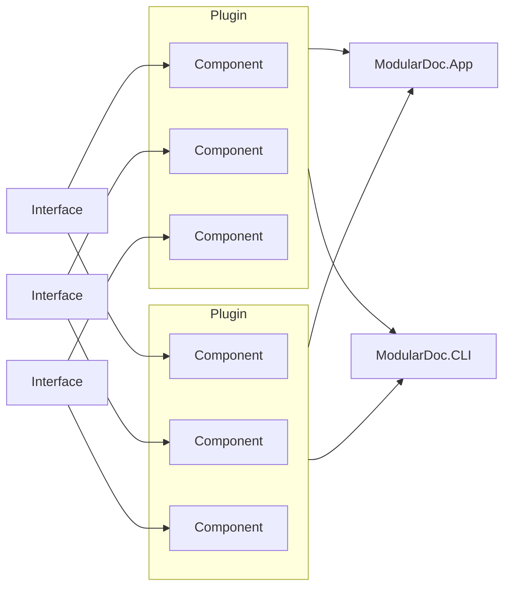

[](https://github.com/hailstorm75/ModularDoc/actions/workflows/dot-core.yml) [](https://www.codefactor.io/repository/github/hailstorm75/modulardoc)  

# Description
The most modular plugin-based documentation generator for your .NET libraries (currently officially supporting C# 9 and lower).

[I'm writing a Bachelor's thesis about this project](https://github.com/hailstorm75/ModularDoc.Thesis).

## What does modular mean?

Generating documentation isn't for everyone. And those who do need it can have very specific needs. That's why ModularDoc is written in such a way, that almost everything is decoupled and can be replaced by you! But that is for the most extreme cases.

The most important feature is pluginability. Using plugins you chose how your documentation is generated. A plugin determines what is the required input, what is/are the output format(s), how the documentation is structured and processed. As of now, these are the available plugins:

 - Markdown for Git - generates Markdown documentation for GitHub, GitLab, and Bitbucket
 
Adding new plugins will extend the functionality of the tool. E.g., generate Markdown for DocFX, generate diagrams only, generate HTML...

There no simple way of describing ModularDoc, as it is very abstract, and defined by the plugins available.

### Plugin: Markdown for Git

- This plugin uses reflection for gathering types and their members from assemblies and reads the XML documentation generated on your project build
- The generated output is a Markdown file per type (interface, class, struct, record, enum...)
- It also provides inheritance diagrams via MermaidJS
- The structure of the documentation is inspired by Doxygen, and is not configurable
- The file structure of the generated files can be configured to be flat, or structured into folders

If you have no *.xml* files in your bin folder, then you can enable it per-project.
You can follow this MSDN [https://learn.microsoft.com/en-us/dotnet/core/project-sdk/msbuild-props](https://learn.microsoft.com/en-us/dotnet/core/project-sdk/msbuild-props#documentationfile), or modify the build property group in your **csproj** to something like [this](https://github.com/hailstorm75/ModularDoc/blob/8656b3c338a7373d035ed41ab8f004b492e0ae70/src/Libraries/Core/ModularDoc.Printer/ModularDoc.Printer.csproj#L13):

```xml
  <PropertyGroup Condition="'$(Configuration)|$(Platform)'=='Debug|AnyCPU'">
    <OutputPath>..\..\..\..\bin\Debug\Libraries\Core</OutputPath>
    <DocumentationFile>..\..\..\..\bin\Debug\Libraries\Core\ModularDoc.Printer.xml</DocumentationFile>
  </PropertyGroup>
```

#### Produced result:
 - [Generated for source code](https://github.com/hailstorm75/ModularDoc/tree/unstable/sourceWiki) - the documentation is stored in the repository right next to your source code
 - [Generated for the GitHub Wiki](https://github.com/hailstorm75/ModularDoc/wiki) - GitHub has poor Wiki management, each generated Markdown file has to be manually uploaded. **The generated examples here are out of date and contain fixed bugs. Use it only as a visual example of the result**

#### Preview


#### Performance

Comparison of ModularDoc's Markdown to Git plugin to Doxygen *v1.9.5* and DocFX *v2.59.4*. Each tool was run four times on Windows OS via Windows PowerShell through the `Measure-Command` script block.

| Run           | ModularDoc     | Doxygen     | DocFX        |
| ------------- | -------------- | ----------- | ------------ |
| 1             |         864 ms |     3609 ms |     34268 ms |
| 2             |         968 ms |     1784 ms |     28662 ms |
| 3             |         869 ms |     1664 ms |     28681 ms |
| 4             |         846 ms |     1660 ms |     28681 ms |
| **Average**   |     **887 ms** | **2179 ms** | **30022 ms** |

## How does it work?

Using **ModularDoc.App** you select one of the available plugins, go through its configuration steps, and finally save the configuration for further reuse.

Then you can open the previously created configuration either via **ModularDoc.App**, or using **ModularDoc.CLI**. The CLI application isn't polished yet, and only supports executing the provided path to the configuration:

`./ModularDoc.CLI.exe PATH_TO_THE_CONFIG.mconf`

## How do I run the tool?

The tool does not have any releases at this time. You have to build it locally. You need at least .NET 6 SDK installed.

 1. Clone the repository `git clone https://github.com/hailstorm75/ModularDoc.git`
 2. Build the solution `dotnet build src/ModularDoc.sln --configuration Release`
 3. Run the `bin/ModularDoc.App.exe`

You can skip steps 2 and 3 if you are using an IDE such as Visual Studio 2019 (and higher) or JetBrains Rider, and use the regular build/run commands.

Next, you select the desired plugin and follow the steps until completion.

You can also run `bin/ModularDoc.CLI.exe` to execute the created configuration via the **ModularDoc.App**:

`./bin/ModularDoc.CLI.exe PATH_TO_THE_CONFIG.mconf`

Run it at your own risk, the code is still under development.

## How to extend the tool?

The architecture is split into interfaces, components, and applications:



- **Interfaces** define abstract contracts that must be implemented by components. Interfaces allow components to communicate with each other without tight coupling. E.g., type and member provider is an abstract interface - no concrete information on how said data is retrieved, only that it is provided
- **Components** are concrete implementations of interfaces. E.g., reflection-based type and member provider - this component uses reflection to analyze assemblies and provide type and member data
- **Plugins** are bundles of concrete components. Plugins provide configuration steps for said components and an endpoint for executing them
- **Applications** are consumers of **plugins** that either display them to the user for further configuration or execute them based on the provided configuration

# External libraries

- [Avalonia UI](https://github.com/AvaloniaUI/Avalonia) for a cross-platform GUI
- [Avalonia Behaviors](https://github.com/wieslawsoltes/AvaloniaBehaviors) for extending GUI building tools of Avalonia UI
- [DynamicData](https://github.com/reactivemarbles/DynamicData) for awesome reactive collections
- [FluentAvaloniaUI](https://github.com/amwx/FluentAvalonia) for the modern FluentUI look
- [Icons.Avalonia](https://github.com/Projektanker/Icons.Avalonia) for adding font-awesome icons support to Avalonia UI
- [xUnit](https://github.com/xunit/xunit) for unit testing
- [Autofac](https://github.com/autofac/Autofac) for dependency injection
- [dnlib](https://github.com/0xd4d/dnlib) for retrieving types from assemblies
