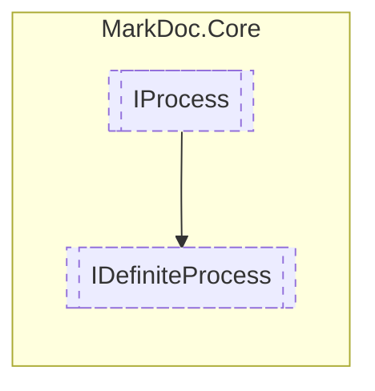

# IDefiniteProcess `interface`

## Description
Interface for definite processes

## Diagram


## Members
### Properties
#### Public  properties
| Type | Name | Methods |
| --- | --- | --- |
| `double` | [`Complete`](markdoc/core/IDefiniteProcess.md#complete)<br>Percentage complete | `get` |
| `int` | [`Current`](markdoc/core/IDefiniteProcess.md#current)<br>Completed parts so far | `get` |
| `int` | [`Max`](markdoc/core/IDefiniteProcess.md#max)<br>Number of parts to be completed | `get` |

### Methods
#### Public  methods
| Returns | Name |
| --- | --- |
| `void` | [`IncreaseCompletion`](markdoc/core/IDefiniteProcess.md#increasecompletion)()<br>Increases the number of complete parts |

## Details
### Summary
Interface for definite processes

### Inheritance
 - [
`IProcess`
](./IProcess.md)

### Methods
#### IncreaseCompletion
```csharp
public abstract void IncreaseCompletion()
```
##### Summary
Increases the number of complete parts

### Properties
#### Complete
```csharp
public abstract double Complete { get; }
```
##### Summary
Percentage complete

#### Current
```csharp
public abstract int Current { get; }
```
##### Summary
Completed parts so far

#### Max
```csharp
public abstract int Max { get; }
```
##### Summary
Number of parts to be completed

*Generated with* [*MarkDoc*](https://github.com/hailstorm75/MarkDoc.Core)
