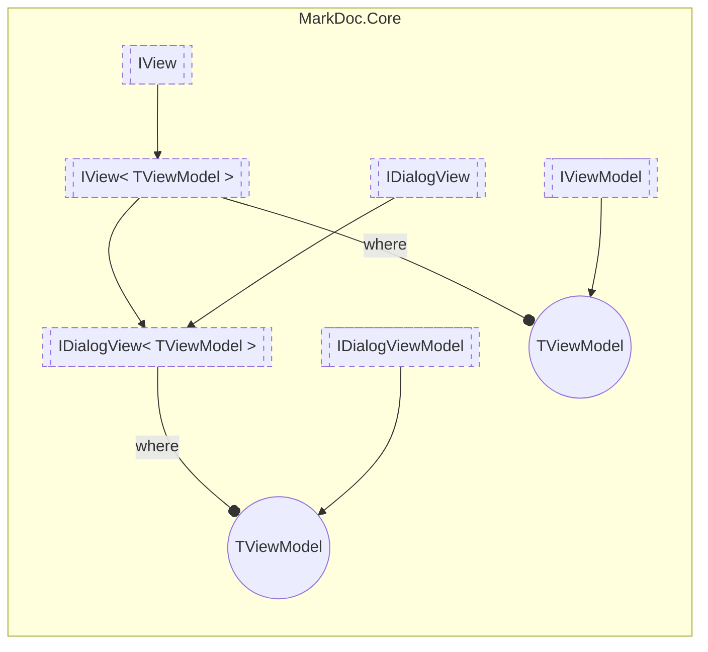

# IDialogView&lt;out TViewModel&gt; `interface`

## Description
Interface for dialog views

## Diagram

## Details
### Summary
Interface for dialog views

### Generic types
| Type | Description | Constraints |
| --- | --- | --- |
| `TViewModel` `out` | View model type for dialog view | [`IDialogViewModel`](./IDialogViewModel.md) |

### Inheritance
 - [`IView`](./IViewT.md)&lt;`TViewModel`&gt;
 - [
`IView`
](./IView.md)
 - [
`IDialogView`
](./IDialogView.md)

*Generated with* [*MarkDoc*](https://github.com/hailstorm75/MarkDoc.Core)
