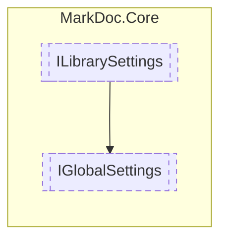

# IGlobalSettings `interface`

## Description
Interface for global settings

## Diagram


## Members
### Properties
#### Public  properties
| Type | Name | Methods |
| --- | --- | --- |
| `IReadOnlyCollection`&lt;`string`&gt; | [`CheckedIgnoredNamespaces`](#checkedignorednamespaces)<br>Globally ignored but previously selected namespaces | `get` |
| `IReadOnlyCollection`&lt;`string`&gt; | [`CheckedIgnoredTypes`](#checkedignoredtypes)<br>Globally ignored but previously selected types | `get` |
| `IReadOnlyCollection`&lt;`string`&gt; | [`IgnoredNamespaces`](#ignorednamespaces)<br>Globally ignored namespaces | `get` |
| `IReadOnlyCollection`&lt;`string`&gt; | [`IgnoredTypes`](#ignoredtypes)<br>Globally ignored types | `get` |
| `string` | [`OutputPath`](#outputpath)<br>Output directory | `get` |

## Details
### Summary
Interface for global settings

### Inheritance
 - [
`ILibrarySettings`
](./ILibrarySettings.md)

### Properties
#### IgnoredNamespaces
```csharp
public abstract IReadOnlyCollection<string> IgnoredNamespaces { get; }
```
##### Summary
Globally ignored namespaces

#### IgnoredTypes
```csharp
public abstract IReadOnlyCollection<string> IgnoredTypes { get; }
```
##### Summary
Globally ignored types

#### CheckedIgnoredNamespaces
```csharp
public abstract IReadOnlyCollection<string> CheckedIgnoredNamespaces { get; }
```
##### Summary
Globally ignored but previously selected namespaces

#### CheckedIgnoredTypes
```csharp
public abstract IReadOnlyCollection<string> CheckedIgnoredTypes { get; }
```
##### Summary
Globally ignored but previously selected types

#### OutputPath
```csharp
public abstract string OutputPath { get; }
```
##### Summary
Output directory

*Generated with* [*MarkDoc*](https://github.com/hailstorm75/MarkDoc.Core)
