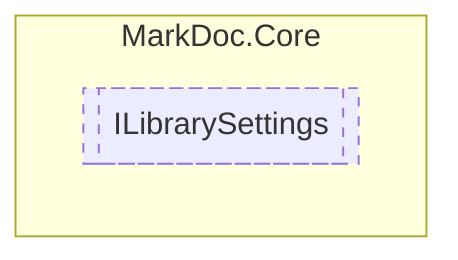

# ILibrarySettings `interface`

## Description
Interface for settings of libraries

## Diagram


## Members
### Properties
#### Public  properties
| Type | Name | Methods |
| --- | --- | --- |
| `Guid` | [`Id`](markdoc/core/ILibrarySettings.md#id)<br>Settings id | `get` |

## Details
### Summary
Interface for settings of libraries

### Properties
#### Id
```csharp
public abstract Guid Id { get }
```
##### Summary
Settings id

*Generated with* [*MarkDoc*](https://github.com/hailstorm75/MarkDoc.Core)
