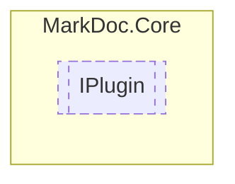

# IPlugin `interface`

## Description
Interface for plugins

## Diagram


## Members
### Properties
#### Public  properties
| Type | Name | Methods |
| --- | --- | --- |
| `string` | [`Author`](#author)<br>Plugin author | `get` |
| `string` | [`Description`](#description)<br>Plugin description | `get` |
| `string` | [`Id`](#id)<br>Plugin id | `get` |
| `Stream` | [`Image`](#image)<br>Plugin image | `get` |
| `string` | [`Name`](#name)<br>Plugin name | `get` |
| `IReadOnlyCollection`&lt;`string`&gt; | [`Steps`](#steps)<br>List of plugin step names | `get` |

### Methods
#### Public  methods
| Returns | Name |
| --- | --- |
| `(IMarkDocLogger logger, IReadOnlyCollection processes, Func executor)` | [`GenerateExecutor`](#generateexecutor)(`IReadOnlyDictionary`&lt;`string`, `IReadOnlyDictionary`&lt;`string`, `string`&gt;&gt; configuration) |
| `IReadOnlyCollection`&lt;[`IPluginStep`](./IPluginStep.md)&gt; | [`GetPluginSteps`](#getpluginsteps)()<br>Get the [IPluginStep](./IPluginStep.md) instances |
| `T` | [`GetSettings`](#getsettings)(`IReadOnlyDictionary`&lt;`string`, `IReadOnlyDictionary`&lt;`string`, `string`&gt;&gt; data) |

## Details
### Summary
Interface for plugins

### Methods
#### GetPluginSteps
```csharp
public abstract IReadOnlyCollection<IPluginStep> GetPluginSteps()
```
##### Summary
Get the [IPluginStep](./IPluginStep.md) instances

##### Returns


#### GetSettings
```csharp
public abstract T GetSettings<T>(IReadOnlyDictionary<string, IReadOnlyDictionary<string, string>> data)
where T : ILibrarySettings
```
##### Arguments
| Type | Name | Description |
| --- | --- | --- |
| `IReadOnlyDictionary`&lt;`string`, `IReadOnlyDictionary`&lt;`string`, `string`&gt;&gt; | data |   |

#### GenerateExecutor
```csharp
public abstract (IMarkDocLogger logger, IReadOnlyCollection processes, Func executor) GenerateExecutor(IReadOnlyDictionary<string, IReadOnlyDictionary<string, string>> configuration)
```
##### Arguments
| Type | Name | Description |
| --- | --- | --- |
| `IReadOnlyDictionary`&lt;`string`, `IReadOnlyDictionary`&lt;`string`, `string`&gt;&gt; | configuration |   |

### Properties
#### Id
```csharp
public abstract string Id { get; }
```
##### Summary
Plugin id

#### Name
```csharp
public abstract string Name { get; }
```
##### Summary
Plugin name

#### Description
```csharp
public abstract string Description { get; }
```
##### Summary
Plugin description

#### Author
```csharp
public abstract string Author { get; }
```
##### Summary
Plugin author

#### Image
```csharp
public abstract Stream Image { get; }
```
##### Summary
Plugin image

#### Steps
```csharp
public abstract IReadOnlyCollection<string> Steps { get; }
```
##### Summary
List of plugin step names

*Generated with* [*MarkDoc*](https://github.com/hailstorm75/MarkDoc.Core)
