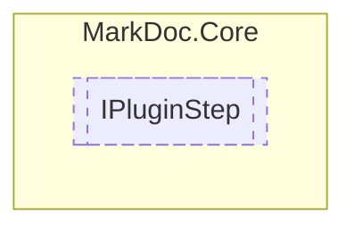

# IPluginStep `interface`

## Description
Interface for plugin steps

## Diagram


## Members
### Properties
#### Public  properties
| Type | Name | Methods |
| --- | --- | --- |
| `string` | [`Id`](#id)<br>Unique identifier of the step | `get` |
| `bool` | [`IsLastStep`](#islaststep)<br>Determines whether this step is last in the step sequence | `get` |
| `string` | [`Name`](#name)<br>Step name | `get` |
| `int` | [`StepNumber`](#stepnumber)<br>Step order number | `get` |

### Methods
#### Public  methods
| Returns | Name |
| --- | --- |
| `Task`&lt;[`IStepView`](./IStepViewT.md)&lt;[`IStepViewModel`](./IStepViewModel.md)&gt;&gt; | [`GetStepViewAsync`](#getstepviewasync)(`IReadOnlyDictionary`&lt;`string`, `string`&gt; settings, `IReadOnlyDictionary`&lt;`string`, `IReadOnlyDictionary`&lt;`string`, `string`&gt;&gt; previousSettings) |
| `string` | [`GetViewId`](#getviewid)()<br>Retrieves the id of the view |

## Details
### Summary
Interface for plugin steps

### Methods
#### GetStepViewAsync
```csharp
public Task<IStepView<IStepViewModel>> GetStepViewAsync(IReadOnlyDictionary<string, string> settings, IReadOnlyDictionary<string, IReadOnlyDictionary<string, string>> previousSettings)
```
##### Arguments
| Type | Name | Description |
| --- | --- | --- |
| `IReadOnlyDictionary`&lt;`string`, `string`&gt; | settings |   |
| `IReadOnlyDictionary`&lt;`string`, `IReadOnlyDictionary`&lt;`string`, `string`&gt;&gt; | previousSettings |   |

#### GetViewId
```csharp
public string GetViewId()
```
##### Summary
Retrieves the id of the view

##### Returns
View id

### Properties
#### Id
```csharp
public string Id { get; }
```
##### Summary
Unique identifier of the step

#### Name
```csharp
public string Name { get; }
```
##### Summary
Step name

#### StepNumber
```csharp
public int StepNumber { get; }
```
##### Summary
Step order number

#### IsLastStep
```csharp
public bool IsLastStep { get; }
```
##### Summary
Determines whether this step is last in the step sequence

*Generated with* [*MarkDoc*](https://github.com/hailstorm75/MarkDoc.Core)
