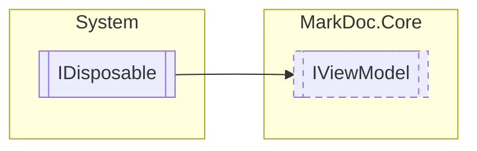

# IViewModel `interface`

## Description
Interface for view models

## Diagram


## Members
### Properties
#### Public  properties
| Type | Name | Methods |
| --- | --- | --- |
| `bool` | [`IsLoading`](markdoc/core/IViewModel.md#isloading)<br>Determines whether the view model is loading | `get` |

### Methods
#### Public  methods
| Returns | Name |
| --- | --- |
| `ValueTask` | [`OnLoadedAsync`](markdoc/core/IViewModel.md#onloadedasync)()<br>Executed when the [IView&lt;out TViewModel&gt;](./IViewT.md) loads |
| `Task` | [`SetNamedArguments`](markdoc/core/IViewModel.md#setnamedarguments)(`IReadOnlyDictionary`&lt;`string`, `string`&gt; arguments) |

## Details
### Summary
Interface for view models

### Inheritance
 - `IDisposable`

### Methods
#### SetNamedArguments
```csharp
public abstract Task SetNamedArguments(IReadOnlyDictionary<string, string> arguments)
```
##### Arguments
| Type | Name | Description |
| --- | --- | --- |
| `IReadOnlyDictionary`&lt;`string`, `string`&gt; | arguments |   |

#### OnLoadedAsync
```csharp
public abstract ValueTask OnLoadedAsync()
```
##### Summary
Executed when the [IView&lt;out TViewModel&gt;](./IViewT.md) loads

##### Returns


### Properties
#### IsLoading
```csharp
public abstract bool IsLoading { get; }
```
##### Summary
Determines whether the view model is loading

*Generated with* [*MarkDoc*](https://github.com/hailstorm75/MarkDoc.Core)
