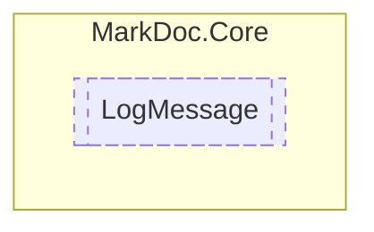

# LogMessage `readonly struct`

## Description
Logger message structure

## Diagram


## Members
### Properties
#### Public  properties
| Type | Name | Methods |
| --- | --- | --- |
| `string` | [`Message`](#message)<br>Log message | `get` |
| `string` | [`Source`](#source)<br>Log source | `get` |
| `DateTime` | [`Time`](#time)<br>Log time | `get` |
| `LogType` | [`Type`](#type)<br>Log type | `get` |

## Details
### Summary
Logger message structure

### Properties
#### Type
```csharp
public LogType Type { get; }
```
##### Summary
Log type

#### Message
```csharp
public string Message { get; }
```
##### Summary
Log message

#### Time
```csharp
public DateTime Time { get; }
```
##### Summary
Log time

#### Source
```csharp
public string Source { get; }
```
##### Summary
Log source

*Generated with* [*MarkDoc*](https://github.com/hailstorm75/MarkDoc.Core)
