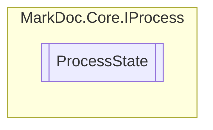

# ProcessState `enum`

## Description
Enumeration of possible states of a [IProcess](../IProcess.md)

## Diagram

## Details
### Summary
Enumeration of possible states of a [IProcess](../IProcess.md)

### Fields
#### Idle
##### Summary
The process is waiting

#### Running
##### Summary
The process is running

#### Success
##### Summary
The process has finished successfully

#### Failure
##### Summary
The process has finished unsuccessfully

#### Cancelled
##### Summary
The process has been cancelled

*Generated with* [*MarkDoc*](https://github.com/hailstorm75/MarkDoc.Core)
