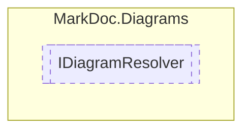

# IDiagramResolver `interface`

## Description
Interface for diagram resolvers

## Diagram


## Members
### Methods
#### Public  methods
| Returns | Name |
| --- | --- |
| `bool` | [`TryGenerateDiagram`](markdoc/diagrams/IDiagramResolver.md#trygeneratediagram)([`IType`](../members/types/IType.md) type, out `(string name, string content)` diagram) |

## Details
### Summary
Interface for diagram resolvers

### Methods
#### TryGenerateDiagram
```csharp
public abstract bool TryGenerateDiagram(IType type, out (string name, string content) diagram)
```
##### Arguments
| Type | Name | Description |
| --- | --- | --- |
| [`IType`](../members/types/IType.md) | type |   |
| `out` `(string name, string content)` | diagram |   |

*Generated with* [*MarkDoc*](https://github.com/hailstorm75/MarkDoc.Core)
