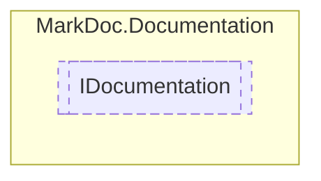

# IDocumentation `interface`

## Description
Interface for documentation containers

## Diagram


## Members
### Properties
#### Public  properties
| Type | Name | Methods |
| --- | --- | --- |
| `bool` | [`HasInheritDoc`](markdoc/documentation/IDocumentation.md#hasinheritdoc)<br>Contains the `inheritdoc` tag | `get` |
| `string` | [`InheritDocRef`](markdoc/documentation/IDocumentation.md#inheritdocref)<br>InheritDoc reference | `get` |
| `IReadOnlyDictionary`&lt;`TagType`, `IReadOnlyCollection`&lt;[`ITag`](tags/ITag.md)&gt;&gt; | [`Tags`](markdoc/documentation/IDocumentation.md#tags)<br>Documentation tags | `get` |

## Details
### Summary
Interface for documentation containers

### Properties
#### Tags
```csharp
public abstract IReadOnlyDictionary Tags { get }
```
##### Summary
Documentation tags

#### HasInheritDoc
```csharp
public abstract bool HasInheritDoc { get }
```
##### Summary
Contains the `inheritdoc` tag

#### InheritDocRef
```csharp
public abstract string InheritDocRef { get }
```
##### Summary
InheritDoc reference

*Generated with* [*MarkDoc*](https://github.com/hailstorm75/MarkDoc.Core)
