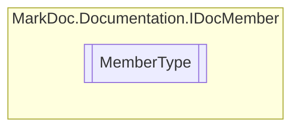

# MemberType `enum`

## Description
Member types

## Diagram

## Details
### Summary
Member types

### Fields
#### Method

#### Property

#### Field

#### Event

*Generated with* [*MarkDoc*](https://github.com/hailstorm75/MarkDoc.Core)
