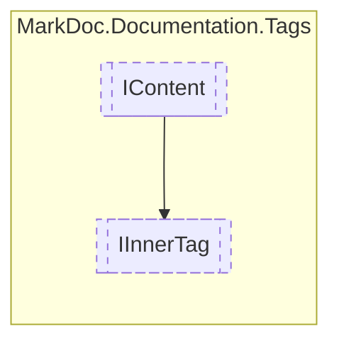

# IInnerTag `interface`

## Description
Interface for tags which are within other tags

## Diagram


## Members
### Properties
#### Public  properties
| Type | Name | Methods |
| --- | --- | --- |
| `IReadOnlyCollection`&lt;[`IContent`](./IContent.md)&gt; | [`Content`](#content)<br>Tag content | `get` |
| `string` | [`Reference`](#reference)<br>Tag reference | `get` |
| `InnerTagType` | [`Type`](#type)<br>Tag type | `get` |

## Details
### Summary
Interface for tags which are within other tags

### Inheritance
 - [
`IContent`
](./IContent.md)

### Nested types
#### Enums
 - `InnerTagType`

### Properties
#### Type
```csharp
public InnerTagType Type { get; }
```
##### Summary
Tag type

#### Reference
```csharp
public string Reference { get; }
```
##### Summary
Tag reference

##### Remarks
Either holds cref or name

#### Content
```csharp
public IReadOnlyCollection<IContent> Content { get; }
```
##### Summary
Tag content

*Generated with* [*MarkDoc*](https://github.com/hailstorm75/MarkDoc.Core)
