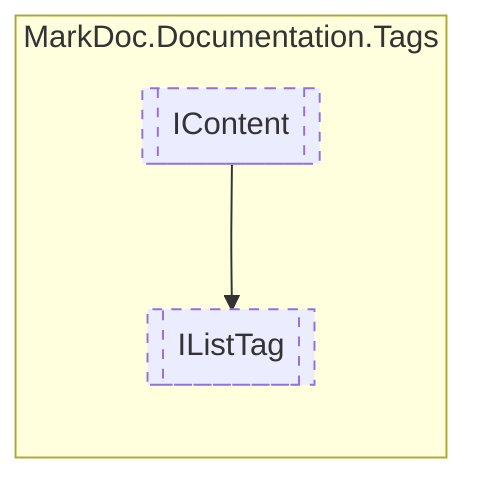

# IListTag `interface`

## Description
Interface for documentation list tags

## Diagram


## Members
### Properties
#### Public  properties
| Type | Name | Methods |
| --- | --- | --- |
| `IReadOnlyCollection`&lt;[`IContent`](./IContent.md)&gt; | [`Headings`](markdoc/documentation/tags/IListTag.md#headings)<br>List headings | `get` |
| `IReadOnlyCollection`&lt;`IReadOnlyCollection`&lt;[`IContent`](./IContent.md)&gt;&gt; | [`Rows`](markdoc/documentation/tags/IListTag.md#rows)<br>List rows | `get` |
| `ListType` | [`Type`](markdoc/documentation/tags/IListTag.md#type)<br>Type of list | `get` |

## Details
### Summary
Interface for documentation list tags

### Inheritance
 - [
`IContent`
](./IContent.md)

### Nested types
#### Enums
 - `ListType`

### Properties
#### Type
```csharp
public abstract ListType Type { get; }
```
##### Summary
Type of list

#### Headings
```csharp
public abstract IReadOnlyCollection<IContent> Headings { get; }
```
##### Summary
List headings

##### Remarks
Used when the list is a [ListType](ilisttag/ListType.md).[Table](markdoc/documentation/tags/IListTag.md#table)

#### Rows
```csharp
public abstract IReadOnlyCollection<IReadOnlyCollection<IContent>> Rows { get; }
```
##### Summary
List rows

*Generated with* [*MarkDoc*](https://github.com/hailstorm75/MarkDoc.Core)
