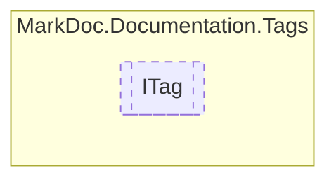

# ITag `interface`

## Description
Interface for documentation tags

## Diagram


## Members
### Properties
#### Public  properties
| Type | Name | Methods |
| --- | --- | --- |
| `IReadOnlyCollection`&lt;[`IContent`](./IContent.md)&gt; | [`Content`](#content)<br>Tag inner content | `get` |
| `string` | [`Reference`](#reference)<br>Tag reference | `get` |
| `TagType` | [`Type`](#type)<br>Tag type | `get` |

## Details
### Summary
Interface for documentation tags

### Nested types
#### Enums
 - `TagType`

### Properties
#### Type
```csharp
public TagType Type { get; }
```
##### Summary
Tag type

##### See also
 - 

#### Reference
```csharp
public string Reference { get; }
```
##### Summary
Tag reference

##### Remarks
Either holds cref or name

#### Content
```csharp
public IReadOnlyCollection<IContent> Content { get; }
```
##### Summary
Tag inner content

*Generated with* [*MarkDoc*](https://github.com/hailstorm75/MarkDoc.Core)
