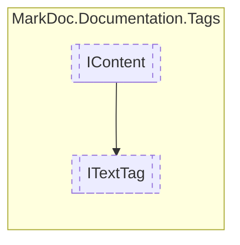

# ITextTag `interface`

## Description
Interface for tags containing text

## Diagram


## Members
### Properties
#### Public  properties
| Type | Name | Methods |
| --- | --- | --- |
| `string` | [`Content`](markdoc/documentation/tags/ITextTag.md#content)<br>Text content | `get` |

## Details
### Summary
Interface for tags containing text

### Inheritance
 - [
`IContent`
](./IContent.md)

### Properties
#### Content
```csharp
public abstract string Content { get; }
```
##### Summary
Text content

*Generated with* [*MarkDoc*](https://github.com/hailstorm75/MarkDoc.Core)
