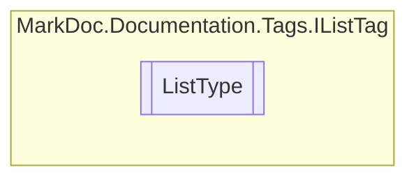

# ListType `enum`

## Description
Type of given list

## Diagram

## Details
### Summary
Type of given list

### Fields
#### Number

#### Bullet

#### Table

*Generated with* [*MarkDoc*](https://github.com/hailstorm75/MarkDoc.Core)
