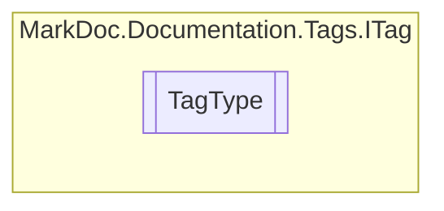

# TagType `enum`

## Description
Tag types

## Diagram

## Details
### Summary
Tag types

### Fields
#### InvalidTag

#### Summary

#### Remarks

#### Example

#### Returns

#### Value

#### Exception

#### Param

#### Typeparam

#### Seealso

#### Inheritdoc

*Generated with* [*MarkDoc*](https://github.com/hailstorm75/MarkDoc.Core)
