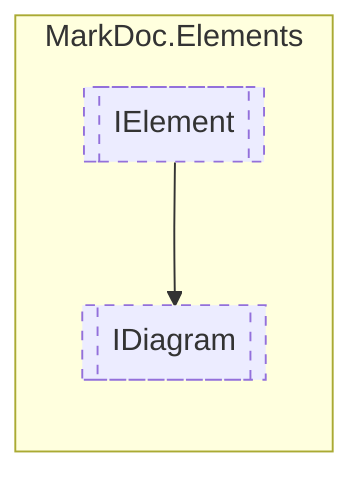

# IDiagram `interface`

## Description
Interface for diagram elements

## Diagram


## Members
### Methods
#### Public  methods
| Returns | Name |
| --- | --- |
| `ValueTask` | [`ToExternalFile`](#toexternalfile)(`string` directory)<br>Exports the diagram to an external file |

## Details
### Summary
Interface for diagram elements

### Inheritance
 - [
`IElement`
](./IElement.md)

### Methods
#### ToExternalFile
```csharp
public ValueTask ToExternalFile(string directory)
```
##### Arguments
| Type | Name | Description |
| --- | --- | --- |
| `string` | directory | Path to the directory to export to |

##### Summary
Exports the diagram to an external file

*Generated with* [*MarkDoc*](https://github.com/hailstorm75/MarkDoc.Core)
