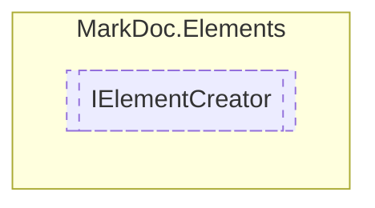

# IElementCreator `interface`

## Description
Interface for [IElement](./IElement.md) creators

## Diagram


## Members
### Methods
#### Public  methods
| Returns | Name |
| --- | --- |
| [`IDiagram`](./IDiagram.md) | [`CreateDiagram`](#creatediagram)(`string` name, `string` content)<br>Creates a new [IDiagram](./IDiagram.md) instance |
| [`ILink`](./ILink.md) | [`CreateLink`](#createlink)([`IText`](./IText.md) content, `Lazy`&lt;`string`&gt; reference) |
| [`IList`](./IList.md) | [`CreateList`](#createlist)(`IEnumerable`&lt;[`IElement`](./IElement.md)&gt; elements, `ListType` type, `string` heading, `int` level) |
| [`IPage`](./IPage.md) | [`CreatePage`](#createpage)(`IEnumerable`&lt;[`IPage`](./IPage.md)&gt; subpages, `IEnumerable`&lt;[`IElement`](./IElement.md)&gt; content, `string` heading, `int` level) |
| [`ISection`](./ISection.md) | [`CreateSection`](#createsection)(`IEnumerable`&lt;[`IElement`](./IElement.md)&gt; content, `string` heading, `int` level) |
| [`ITable`](./ITable.md) | [`CreateTable`](#createtable)(`IEnumerable`&lt;`IReadOnlyCollection`&lt;[`IElement`](./IElement.md)&gt;&gt; content, `IEnumerable`&lt;[`IText`](./IText.md)&gt; headings, `string` heading, `int` level) |
| [`IText`](./IText.md) | [`CreateText`](#createtext)(`string` content, `TextStyle` style) |
| [`ITextContent`](./ITextContent.md) | [`JoinTextContent`](#jointextcontent)(`IEnumerable`&lt;[`ITextContent`](./ITextContent.md)&gt; content, `string` delimiter) |

## Details
### Summary
Interface for [IElement](./IElement.md) creators

### Methods
#### CreateList
```csharp
public IList CreateList(IEnumerable<IElement> elements, ListType type, string heading, int level)
```
##### Arguments
| Type | Name | Description |
| --- | --- | --- |
| `IEnumerable`&lt;[`IElement`](./IElement.md)&gt; | elements |   |
| `ListType` | type |   |
| `string` | heading |   |
| `int` | level |   |

#### CreateSection
```csharp
public ISection CreateSection(IEnumerable<IElement> content, string heading, int level)
```
##### Arguments
| Type | Name | Description |
| --- | --- | --- |
| `IEnumerable`&lt;[`IElement`](./IElement.md)&gt; | content |   |
| `string` | heading |   |
| `int` | level |   |

#### CreateTable
```csharp
public ITable CreateTable(IEnumerable<IReadOnlyCollection<IElement>> content, IEnumerable<IText> headings, string heading, int level)
```
##### Arguments
| Type | Name | Description |
| --- | --- | --- |
| `IEnumerable`&lt;`IReadOnlyCollection`&lt;[`IElement`](./IElement.md)&gt;&gt; | content |   |
| `IEnumerable`&lt;[`IText`](./IText.md)&gt; | headings |   |
| `string` | heading |   |
| `int` | level |   |

#### CreatePage
```csharp
public IPage CreatePage(IEnumerable<IPage> subpages, IEnumerable<IElement> content, string heading, int level)
```
##### Arguments
| Type | Name | Description |
| --- | --- | --- |
| `IEnumerable`&lt;[`IPage`](./IPage.md)&gt; | subpages |   |
| `IEnumerable`&lt;[`IElement`](./IElement.md)&gt; | content |   |
| `string` | heading |   |
| `int` | level |   |

#### CreateText
```csharp
public IText CreateText(string content, TextStyle style)
```
##### Arguments
| Type | Name | Description |
| --- | --- | --- |
| `string` | content |   |
| `TextStyle` | style |   |

#### CreateDiagram
```csharp
public IDiagram CreateDiagram(string name, string content)
```
##### Arguments
| Type | Name | Description |
| --- | --- | --- |
| `string` | name | Diagram name |
| `string` | content | Diagram data source |

##### Summary
Creates a new [IDiagram](./IDiagram.md) instance

##### Returns


#### CreateLink
```csharp
public ILink CreateLink(IText content, Lazy<string> reference)
```
##### Arguments
| Type | Name | Description |
| --- | --- | --- |
| [`IText`](./IText.md) | content |   |
| `Lazy`&lt;`string`&gt; | reference |   |

#### JoinTextContent
```csharp
public ITextContent JoinTextContent(IEnumerable<ITextContent> content, string delimiter)
```
##### Arguments
| Type | Name | Description |
| --- | --- | --- |
| `IEnumerable`&lt;[`ITextContent`](./ITextContent.md)&gt; | content |   |
| `string` | delimiter |   |

*Generated with* [*MarkDoc*](https://github.com/hailstorm75/MarkDoc.Core)
