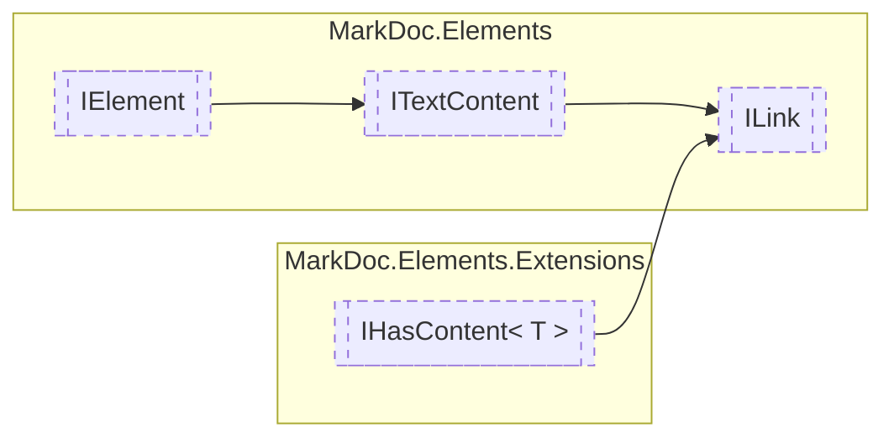

# ILink `interface`

## Description
Interface for link elements

## Diagram


## Members
### Properties
#### Public  properties
| Type | Name | Methods |
| --- | --- | --- |
| `Lazy`&lt;`string`&gt; | [`Reference`](#reference)<br>Link reference | `get` |

## Details
### Summary
Interface for link elements

### Inheritance
 - [
`ITextContent`
](./ITextContent.md)
 - [
`IElement`
](./IElement.md)
 - [`IHasContent`](extensions/IHasContentT.md)&lt;[`IText`](./IText.md)&gt;

### Properties
#### Reference
```csharp
public Lazy<string> Reference { get; }
```
##### Summary
Link reference

##### Value
String containing a URI

*Generated with* [*MarkDoc*](https://github.com/hailstorm75/MarkDoc.Core)
