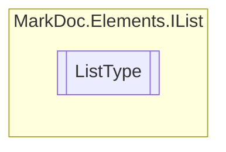

# ListType `enum`

## Description
Possible list types

## Diagram

## Details
### Summary
Possible list types

### Fields
#### Numbered

#### Dotted

*Generated with* [*MarkDoc*](https://github.com/hailstorm75/MarkDoc.Core)
