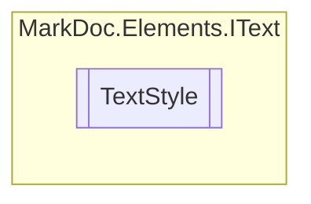

# TextStyle `enum`

## Description
Text styles

## Diagram

## Details
### Summary
Text styles

### Fields
#### Normal

#### Italic

#### Bold

#### CodeInline

#### Code

*Generated with* [*MarkDoc*](https://github.com/hailstorm75/MarkDoc.Core)
