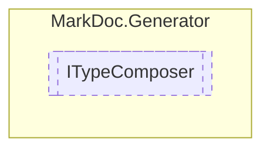

# ITypeComposer `interface`

## Description
Interface for type printers

## Diagram


## Members
### Methods
#### Public  methods
| Returns | Name |
| --- | --- |
| [`IPage`](../elements/IPage.md) | [`Compose`](markdoc/generator/ITypeComposer.md#compose)([`IType`](../members/types/IType.md) type)<br>Composes a [IPage](../elements/IPage.md) from the provided `type` |
| [`IPage`](../elements/IPage.md) | [`ComposeTableOfContents`](markdoc/generator/ITypeComposer.md#composetableofcontents)()<br>Composes a [IPage](../elements/IPage.md) containing links to all types |

## Details
### Summary
Interface for type printers

### Methods
#### Compose
```csharp
public abstract IPage Compose(IType type)
```
##### Arguments
| Type | Name | Description |
| --- | --- | --- |
| [`IType`](../members/types/IType.md) | type | Type to process |

##### Summary
Composes a [IPage](../elements/IPage.md) from the provided `type`

##### Returns
Composed page

#### ComposeTableOfContents
```csharp
public abstract IPage ComposeTableOfContents()
```
##### Summary
Composes a [IPage](../elements/IPage.md) containing links to all types

##### Returns
Composed page

*Generated with* [*MarkDoc*](https://github.com/hailstorm75/MarkDoc.Core)
