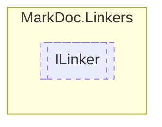

# ILinker `interface`

## Description
Interface for creating links

## Diagram


## Members
### Properties
#### Public  properties
| Type | Name | Methods |
| --- | --- | --- |
| `IReadOnlyDictionary`&lt;[`IType`](../members/types/IType.md), `string`&gt; | [`Paths`](markdoc/linkers/ILinker.md#paths)<br>Types path structure | `get` |

### Methods
#### Public  methods
| Returns | Name |
| --- | --- |
| `Lazy` | [`CreateAnchor`](markdoc/linkers/ILinker.md#createanchor)([`IType`](../members/types/IType.md) page, [`IMember`](../members/members/IMember.md) member)<br>Creates an anchor to a given `member` |
| `string` | [`CreateLink`](markdoc/linkers/ILinker.md#createlink-12)(`...`)<br>Creates a link to a given type `target` |
| `string` | [`CreateLinkToSourceCode`](markdoc/linkers/ILinker.md#createlinktosourcecode)([`IMember`](../members/members/IMember.md) member) |
| `void` | [`RegisterAnchor`](markdoc/linkers/ILinker.md#registeranchor)([`IMember`](../members/members/IMember.md) member, `Lazy`&lt;`string`&gt; anchor) |

## Details
### Summary
Interface for creating links

### Methods
#### CreateLink [1/2]
```csharp
public abstract string CreateLink(IType source, IResType target)
```
##### Arguments
| Type | Name | Description |
| --- | --- | --- |
| [`IType`](../members/types/IType.md) | source | Link from |
| [`IResType`](../members/resolvedtypes/IResType.md) | target | Link target |

##### Summary
Creates a link to a given type `target`

##### Returns
Retrieved link

#### CreateLink [2/2]
```csharp
public abstract string CreateLink(IType source, IType target)
```
##### Arguments
| Type | Name | Description |
| --- | --- | --- |
| [`IType`](../members/types/IType.md) | source |  |
| [`IType`](../members/types/IType.md) | target |  |

##### Summary
Creates a link to a given type `target`

##### Returns
Retrieved link

#### CreateAnchor
```csharp
public abstract Lazy CreateAnchor(IType page, IMember member)
```
##### Arguments
| Type | Name | Description |
| --- | --- | --- |
| [`IType`](../members/types/IType.md) | page | Page type |
| [`IMember`](../members/members/IMember.md) | member | Member to link to |

##### Summary
Creates an anchor to a given `member`

##### Returns
Retrieved link

#### RegisterAnchor
```csharp
public abstract void RegisterAnchor(IMember member, Lazy<string> anchor)
```
##### Arguments
| Type | Name | Description |
| --- | --- | --- |
| [`IMember`](../members/members/IMember.md) | member |   |
| `Lazy`&lt;`string`&gt; | anchor |   |

#### CreateLinkToSourceCode
```csharp
public abstract string CreateLinkToSourceCode(IMember member)
```
##### Arguments
| Type | Name | Description |
| --- | --- | --- |
| [`IMember`](../members/members/IMember.md) | member |   |

### Properties
#### Paths
```csharp
public abstract IReadOnlyDictionary Paths { get }
```
##### Summary
Types path structure

*Generated with* [*MarkDoc*](https://github.com/hailstorm75/MarkDoc.Core)
