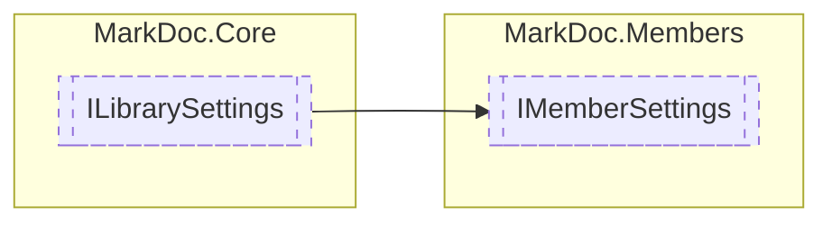

# IMemberSettings `interface`

## Description
Interface for [IResolver](./IResolver.md) settings

## Diagram


## Members
### Properties
#### Public  properties
| Type | Name | Methods |
| --- | --- | --- |
| `IReadOnlyCollection`&lt;`string`&gt; | [`Paths`](markdoc/members/IMemberSettings.md#paths)<br>Paths to member sources | `get` |

## Details
### Summary
Interface for [IResolver](./IResolver.md) settings

### Inheritance
 - [
`ILibrarySettings`
](../core/ILibrarySettings.md)

### Properties
#### Paths
```csharp
public abstract IReadOnlyCollection Paths { get }
```
##### Summary
Paths to member sources

*Generated with* [*MarkDoc*](https://github.com/hailstorm75/MarkDoc.Core)
