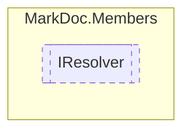

# IResolver `interface`

## Description
Type resolver

## Diagram


## Members
### Properties
#### Public  properties
| Type | Name | Methods |
| --- | --- | --- |
| `Lazy`&lt;`IReadOnlyDictionary`&lt;`string`, `IReadOnlyCollection`&lt;[`IType`](types/IType.md)&gt;&gt;&gt; | [`Types`](markdoc/members/IResolver.md#types)<br>Resolved types | `get` |

### Methods
#### Public  methods
| Returns | Name |
| --- | --- |
| `void` | [`Resolve`](markdoc/members/IResolver.md#resolve)(`string` assembly)<br>Resolves `assembly` types |
| `Task` | [`ResolveAsync`](markdoc/members/IResolver.md#resolveasync)([`IMemberSettings`](./IMemberSettings.md) memberSettings, [`IGlobalSettings`](../core/IGlobalSettings.md) globalSettings)<br>Resolves all assemblies based on the given settings |
| `bool` | [`TryFindType`](markdoc/members/IResolver.md#tryfindtype)(`string` fullname, out [`IType`](types/IType.md) result) |
| `bool` | [`TryGetMemberSourceLine`](markdoc/members/IResolver.md#trygetmembersourceline)(`int` token, out `int` line, out `string` source) |

## Details
### Summary
Type resolver

### Methods
#### ResolveAsync
```csharp
public abstract Task ResolveAsync(IMemberSettings memberSettings, IGlobalSettings globalSettings)
```
##### Arguments
| Type | Name | Description |
| --- | --- | --- |
| [`IMemberSettings`](./IMemberSettings.md) | memberSettings |   |
| [`IGlobalSettings`](../core/IGlobalSettings.md) | globalSettings |   |

##### Summary
Resolves all assemblies based on the given settings

##### Returns


#### Resolve
```csharp
public abstract void Resolve(string assembly)
```
##### Arguments
| Type | Name | Description |
| --- | --- | --- |
| `string` | assembly | Path to assembly |

##### Summary
Resolves `assembly` types

#### TryFindType
```csharp
public abstract bool TryFindType(string fullname, out IType result)
```
##### Arguments
| Type | Name | Description |
| --- | --- | --- |
| `string` | fullname |   |
| `out` [`IType`](types/IType.md) | result |   |

#### TryGetMemberSourceLine
```csharp
public abstract bool TryGetMemberSourceLine(int token, out int line, out string source)
```
##### Arguments
| Type | Name | Description |
| --- | --- | --- |
| `int` | token |   |
| `out` `int` | line |   |
| `out` `string` | source |   |

### Properties
#### Types
```csharp
public abstract Lazy<IReadOnlyDictionary<string, IReadOnlyCollection<IType>>> Types { get; }
```
##### Summary
Resolved types

*Generated with* [*MarkDoc*](https://github.com/hailstorm75/MarkDoc.Core)
