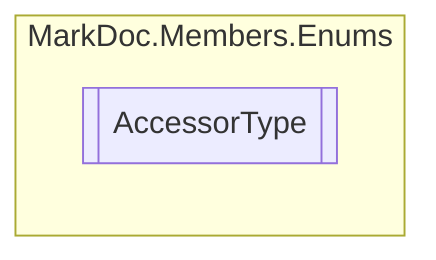

# AccessorType `enum`

## Description
Types of member accessors

## Diagram

## Details
### Summary
Types of member accessors

### Fields
#### Public

#### Protected

#### Internal

#### ProtectedInternal

*Generated with* [*MarkDoc*](https://github.com/hailstorm75/MarkDoc.Core)
