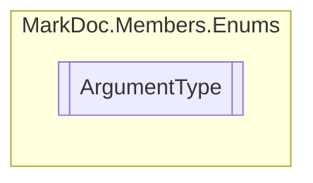

# ArgumentType `enum`

## Description
Types of arguments

## Diagram

## Details
### Summary
Types of arguments

### Fields
#### Normal
##### Summary
Argument with no keyword

#### Ref
##### Summary
Argument with the ref keyword

#### Out
##### Summary
Argument with the out keyword

#### In
##### Summary
Argument with the in keyword

#### Optional
##### Summary
Argument is optional

#### Param
##### Summary
Argument is variadic

*Generated with* [*MarkDoc*](https://github.com/hailstorm75/MarkDoc.Core)
