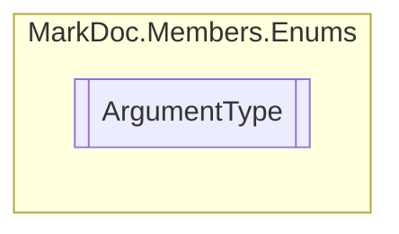

# ArgumentType `enum`

## Description
Types of arguments

## Diagram

## Details
### Summary
Types of arguments

### Fields
#### Normal

#### Ref

#### Out

#### In

#### Optional

#### Param

*Generated with* [*MarkDoc*](https://github.com/hailstorm75/MarkDoc.Core)
