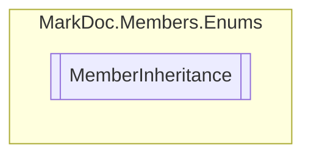

# MemberInheritance `enum`

## Description
Member inheritance types

## Diagram

## Details
### Summary
Member inheritance types

### Fields
#### Normal
##### Summary
No inheritance

#### Abstract
##### Summary
Abstract member

#### Virtual
##### Summary
Virtual member

#### Override
##### Summary
Override member

#### InterfaceMember
##### Summary
Member is defined within an interface

*Generated with* [*MarkDoc*](https://github.com/hailstorm75/MarkDoc.Core)
