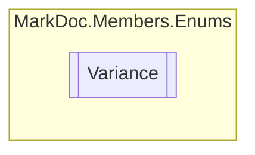

# Variance `enum`

## Description
Generic argument variance types

## Diagram

## Details
### Summary
Generic argument variance types

### Fields
#### NonVariant

#### Covariant

#### Contravariant

*Generated with* [*MarkDoc*](https://github.com/hailstorm75/MarkDoc.Core)
