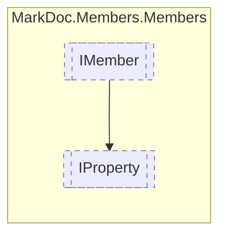

# IProperty `interface`

## Description
Interface for properties

## Diagram


## Members
### Properties
#### Public  properties
| Type | Name | Methods |
| --- | --- | --- |
| `Nullable`&lt;[`AccessorType`](../enums/AccessorType.md)&gt; | [`GetAccessor`](#getaccessor)<br>Property get accessor type | `get` |
| [`MemberInheritance`](../enums/MemberInheritance.md) | [`Inheritance`](#inheritance)<br>Property visibility | `get` |
| `bool` | [`IsReadOnly`](#isreadonly)<br>Determines whether the property is readonly | `get` |
| `bool` | [`IsSetInit`](#issetinit)<br>Is the property setter an init type | `get` |
| `Nullable`&lt;[`AccessorType`](../enums/AccessorType.md)&gt; | [`SetAccessor`](#setaccessor)<br>Property set accessor type | `get` |
| [`IResType`](../resolvedtypes/IResType.md) | [`Type`](#type)<br>Property type | `get` |

## Details
### Summary
Interface for properties

### Inheritance
 - [
`IMember`
](./IMember.md)

### Properties
#### Inheritance
```csharp
public MemberInheritance Inheritance { get; }
```
##### Summary
Property visibility

#### Type
```csharp
public IResType Type { get; }
```
##### Summary
Property type

#### IsReadOnly
```csharp
public bool IsReadOnly { get; }
```
##### Summary
Determines whether the property is readonly

##### Remarks
Applicable only for [IStruct](../types/IStruct.md) properties

#### GetAccessor
```csharp
public Nullable<AccessorType> GetAccessor { get; }
```
##### Summary
Property get accessor type

#### SetAccessor
```csharp
public Nullable<AccessorType> SetAccessor { get; }
```
##### Summary
Property set accessor type

#### IsSetInit
```csharp
public bool IsSetInit { get; }
```
##### Summary
Is the property setter an init type

*Generated with* [*MarkDoc*](https://github.com/hailstorm75/MarkDoc.Core)
