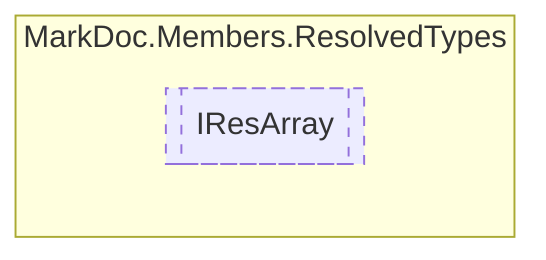

# IResArray `interface`

## Description
Interface for resolved arrays

## Diagram


## Members
### Properties
#### Public  properties
| Type | Name | Methods |
| --- | --- | --- |
| [`IResType`](./IResType.md) | [`ArrayType`](#arraytype)<br>Type of given array | `get` |
| `int` | [`Dimension`](#dimension)<br>Dimension of array | `get` |
| `bool` | [`IsJagged`](#isjagged)<br>Determines whether the array is a jagged array type | `get` |

## Details
### Summary
Interface for resolved arrays

### Properties
#### ArrayType
```csharp
public IResType ArrayType { get; }
```
##### Summary
Type of given array

#### IsJagged
```csharp
public bool IsJagged { get; }
```
##### Summary
Determines whether the array is a jagged array type

#### Dimension
```csharp
public int Dimension { get; }
```
##### Summary
Dimension of array

*Generated with* [*MarkDoc*](https://github.com/hailstorm75/MarkDoc.Core)
