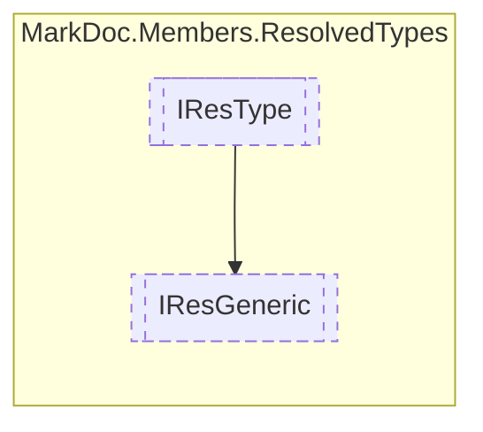

# IResGeneric `interface`

## Description
Interface for generic resolved types

## Diagram


## Members
### Properties
#### Public  properties
| Type | Name | Methods |
| --- | --- | --- |
| `IReadOnlyCollection`&lt;[`IResType`](./IResType.md)&gt; | [`Generics`](markdoc/members/resolvedtypes/IResGeneric.md#generics)<br>Generic parameter types | `get` |

## Details
### Summary
Interface for generic resolved types

### Inheritance
 - [
`IResType`
](./IResType.md)

### Properties
#### Generics
```csharp
public abstract IReadOnlyCollection<IResType> Generics { get; }
```
##### Summary
Generic parameter types

*Generated with* [*MarkDoc*](https://github.com/hailstorm75/MarkDoc.Core)
