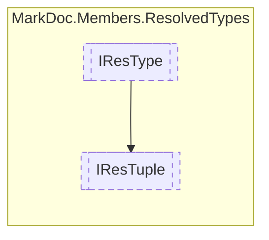

# IResTuple `interface`

## Description
Interface for resolved tuples

## Diagram


## Members
### Properties
#### Public  properties
| Type | Name | Methods |
| --- | --- | --- |
| `IReadOnlyCollection`&lt;`(string Item1, IResType Item2)`&gt; | [`Fields`](markdoc/members/resolvedtypes/IResTuple.md#fields)<br>Tuple fields | `get` |
| `bool` | [`IsValueTuple`](markdoc/members/resolvedtypes/IResTuple.md#isvaluetuple)<br>Determines whether the tuple is a value tuple | `get` |

## Details
### Summary
Interface for resolved tuples

### Inheritance
 - [
`IResType`
](./IResType.md)

### Properties
#### Fields
```csharp
public abstract IReadOnlyCollection<(string Item1, IResType Item2)> Fields { get; }
```
##### Summary
Tuple fields

#### IsValueTuple
```csharp
public abstract bool IsValueTuple { get; }
```
##### Summary
Determines whether the tuple is a value tuple

*Generated with* [*MarkDoc*](https://github.com/hailstorm75/MarkDoc.Core)
