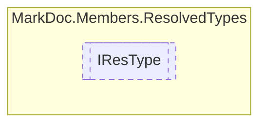

# IResType `interface`

## Description
Interface for resolved types

## Diagram


## Members
### Properties
#### Public  properties
| Type | Name | Methods |
| --- | --- | --- |
| `string` | [`DisplayName`](#displayname)<br>Resolved type display name | `get` |
| `string` | [`DocumentationName`](#documentationname)<br>Resolved type name for documentation | `get` |
| `bool` | [`IsByRef`](#isbyref)<br>Is the type a reference | `get` |
| `string` | [`RawName`](#rawname)<br>Resolved type raw name | `get` |
| `Lazy`&lt;[`IType`](../types/IType.md)&gt; | [`Reference`](#reference)<br>Reference to known type | `get` |
| `string` | [`TypeNamespace`](#typenamespace)<br>Resolved type namespace | `get` |

## Details
### Summary
Interface for resolved types

### Properties
#### DisplayName
```csharp
public abstract string DisplayName { get; }
```
##### Summary
Resolved type display name

#### DocumentationName
```csharp
public abstract string DocumentationName { get; }
```
##### Summary
Resolved type name for documentation

#### RawName
```csharp
public abstract string RawName { get; }
```
##### Summary
Resolved type raw name

#### TypeNamespace
```csharp
public abstract string TypeNamespace { get; }
```
##### Summary
Resolved type namespace

#### Reference
```csharp
public abstract Lazy<IType> Reference { get; }
```
##### Summary
Reference to known type

#### IsByRef
```csharp
public abstract bool IsByRef { get; }
```
##### Summary
Is the type a reference

*Generated with* [*MarkDoc*](https://github.com/hailstorm75/MarkDoc.Core)
