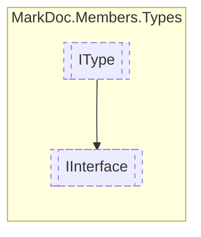

# IInterface `interface`

## Description
Interface for interface types

## Diagram


## Members
### Properties
#### Public  properties
| Type | Name | Methods |
| --- | --- | --- |
| `IReadOnlyCollection`&lt;[`IDelegate`](../members/IDelegate.md)&gt; | [`Delegates`](#delegates)<br>Collection of delegates | `get` |
| `IReadOnlyCollection`&lt;[`IEvent`](../members/IEvent.md)&gt; | [`Events`](#events)<br>Collection of events | `get` |
| `IReadOnlyDictionary`&lt;`string`, `(Variance Item1, IReadOnlyCollection Item2)`&gt; | [`Generics`](#generics)<br>Generics name, and their variance and constraints | `get` |
| `Lazy`&lt;`IReadOnlyDictionary`&lt;[`IMember`](../members/IMember.md), [`IInterface`](markdoc/members/types/IInterface.md)&gt;&gt; | [`InheritedTypeMembers`](#inheritedtypemembers)<br>Members inherited from derived types | `get` |
| `IReadOnlyCollection`&lt;[`IResType`](../resolvedtypes/IResType.md)&gt; | [`InheritedTypesFlat`](#inheritedtypesflat)<br>Collection of inherited types | `get` |
| `Lazy`&lt;`IReadOnlyCollection`&lt;[`TreeNode`](./TreeNode.md)&gt;&gt; | [`InheritedTypesStructured`](#inheritedtypesstructured)<br>Structured inherited types | `get` |
| `IReadOnlyCollection`&lt;[`IMethod`](../members/IMethod.md)&gt; | [`Methods`](#methods)<br>Collection of methods | `get` |
| `IReadOnlyCollection`&lt;[`IType`](./IType.md)&gt; | [`NestedTypes`](#nestedtypes)<br>Collection of nested types | `get` |
| `IReadOnlyCollection`&lt;[`IProperty`](../members/IProperty.md)&gt; | [`Properties`](#properties)<br>Collection of properties | `get` |

## Details
### Summary
Interface for interface types

### Inheritance
 - [
`IType`
](./IType.md)

### Properties
#### InheritedTypesFlat
```csharp
public abstract IReadOnlyCollection<IResType> InheritedTypesFlat { get; }
```
##### Summary
Collection of inherited types

#### InheritedTypesStructured
```csharp
public abstract Lazy<IReadOnlyCollection<TreeNode>> InheritedTypesStructured { get; }
```
##### Summary
Structured inherited types

#### Generics
```csharp
public abstract IReadOnlyDictionary<string, (Variance Item1, IReadOnlyCollection Item2)> Generics { get; }
```
##### Summary
Generics name, and their variance and constraints

#### Delegates
```csharp
public abstract IReadOnlyCollection<IDelegate> Delegates { get; }
```
##### Summary
Collection of delegates

#### NestedTypes
```csharp
public abstract IReadOnlyCollection<IType> NestedTypes { get; }
```
##### Summary
Collection of nested types

#### Events
```csharp
public abstract IReadOnlyCollection<IEvent> Events { get; }
```
##### Summary
Collection of events

#### Methods
```csharp
public abstract IReadOnlyCollection<IMethod> Methods { get; }
```
##### Summary
Collection of methods

#### Properties
```csharp
public abstract IReadOnlyCollection<IProperty> Properties { get; }
```
##### Summary
Collection of properties

#### InheritedTypeMembers
```csharp
public abstract Lazy<IReadOnlyDictionary<IMember, IInterface>> InheritedTypeMembers { get; }
```
##### Summary
Members inherited from derived types

*Generated with* [*MarkDoc*](https://github.com/hailstorm75/MarkDoc.Core)
