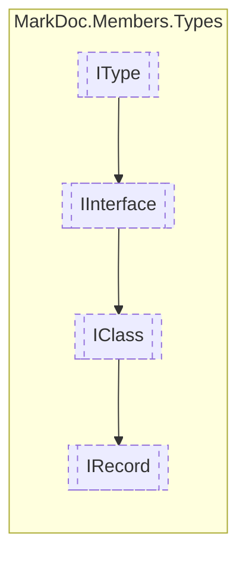

# IRecord `interface`

## Description
Interface for records

## Diagram

## Details
### Summary
Interface for records

### Inheritance
 - [
`IClass`
](./IClass.md)
 - [
`IInterface`
](./IInterface.md)
 - [
`IType`
](./IType.md)

*Generated with* [*MarkDoc*](https://github.com/hailstorm75/MarkDoc.Core)
