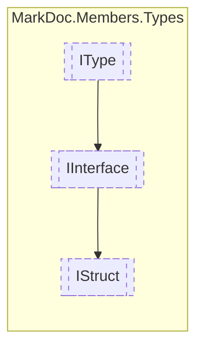

# IStruct `interface`

## Description
Interface for struct types

## Diagram


## Members
### Properties
#### Public  properties
| Type | Name | Methods |
| --- | --- | --- |
| `IReadOnlyCollection`&lt;[`IConstructor`](../members/IConstructor.md)&gt; | [`Constructors`](#constructors)<br>Struct constructors | `get` |
| `bool` | [`IsReadOnly`](#isreadonly)<br>Determines whether the struct is readonly | `get` |

## Details
### Summary
Interface for struct types

### Inheritance
 - [
`IInterface`
](./IInterface.md)
 - [
`IType`
](./IType.md)

### Properties
#### Constructors
```csharp
public abstract IReadOnlyCollection<IConstructor> Constructors { get; }
```
##### Summary
Struct constructors

#### IsReadOnly
```csharp
public abstract bool IsReadOnly { get; }
```
##### Summary
Determines whether the struct is readonly

*Generated with* [*MarkDoc*](https://github.com/hailstorm75/MarkDoc.Core)
