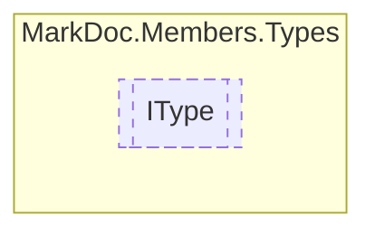

# IType `interface`

## Description
Interface for types

## Diagram


## Members
### Properties
#### Public  properties
| Type | Name | Methods |
| --- | --- | --- |
| [`AccessorType`](../enums/AccessorType.md) | [`Accessor`](#accessor)<br>Type accessor | `get` |
| `bool` | [`IsNested`](#isnested)<br>Determines whether this type is nested | `get` |
| `string` | [`Name`](#name)<br>Type name | `get` |
| `string` | [`RawName`](#rawname)<br>Reflection fullname with namespace | `get` |
| [`DotNetType`](../enums/DotNetType.md) | [`Type`](#type)<br>Determines the dot net type represented by this instance | `get` |
| `string` | [`TypeNamespace`](#typenamespace)<br>Type namespace | `get` |

## Details
### Summary
Interface for types

### Properties
#### RawName
```csharp
public string RawName { get; }
```
##### Summary
Reflection fullname with namespace

#### Name
```csharp
public string Name { get; }
```
##### Summary
Type name

#### TypeNamespace
```csharp
public string TypeNamespace { get; }
```
##### Summary
Type namespace

#### IsNested
```csharp
public bool IsNested { get; }
```
##### Summary
Determines whether this type is nested

#### Accessor
```csharp
public AccessorType Accessor { get; }
```
##### Summary
Type accessor

#### Type
```csharp
public DotNetType Type { get; }
```
##### Summary
Determines the dot net type represented by this instance

*Generated with* [*MarkDoc*](https://github.com/hailstorm75/MarkDoc.Core)
