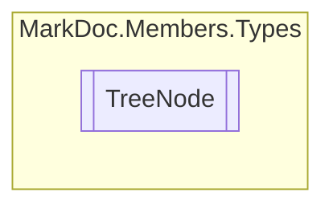

# TreeNode `class`

## Description
Node of a tree structure

## Diagram


## Members
### Properties
#### Public  properties
| Type | Name | Methods |
| --- | --- | --- |
| `IReadOnlyCollection`&lt;[`TreeNode`](markdoc/members/types/TreeNode.md)&gt; | [`Children`](#children)<br>Child nodes | `get` |
| `string` | [`Name`](#name)<br>Node name | `get` |
| [`IResType`](../resolvedtypes/IResType.md) | [`Value`](#value)<br>Contained node type | `get` |

## Details
### Summary
Node of a tree structure

### Constructors
#### TreeNode
[*Source code*](https://github.com///blob//src/Libraries/Core/MarkDoc.Members/Types/TreeNode.cs#L29)
```csharp
public TreeNode(string name, IResType value, IReadOnlyCollection<TreeNode> children)
```
##### Arguments
| Type | Name | Description |
| --- | --- | --- |
| `string` | name |   |
| [`IResType`](../resolvedtypes/IResType.md) | value |   |
| `IReadOnlyCollection`&lt;[`TreeNode`](markdoc/members/types/TreeNode.md)&gt; | children |   |

### Properties
#### Name
```csharp
public string Name { get; }
```
##### Summary
Node name

#### Value
```csharp
public IResType Value { get; }
```
##### Summary
Contained node type

#### Children
```csharp
public IReadOnlyCollection<TreeNode> Children { get; }
```
##### Summary
Child nodes

*Generated with* [*MarkDoc*](https://github.com/hailstorm75/MarkDoc.Core)
