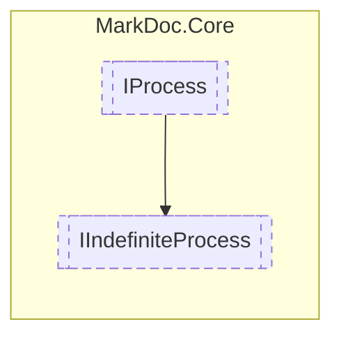

# IIndefiniteProcess `interface`

## Description
Interface for indefinite processes

## Diagram

## Details
### Summary
Interface for indefinite processes

### Inheritance
 - [
`IProcess`
](./markdoccore-IProcess.md)

*Generated with* [*MarkDoc*](https://github.com/hailstorm75/MarkDoc.Core)
