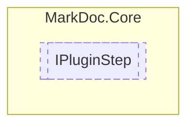

# IPluginStep `interface`

## Description
Interface for plugin steps

## Diagram


## Members
### Properties
#### Public  properties
| Type | Name | Methods |
| --- | --- | --- |
| `string` | [`Id`](markdoccore-IPluginStep.md#id)<br>Unique identifier of the step | `get` |
| `bool` | [`IsLastStep`](markdoccore-IPluginStep.md#islaststep)<br>Determines whether this step is last in the step sequence | `get` |
| `string` | [`Name`](markdoccore-IPluginStep.md#name)<br>Step name | `get` |
| `int` | [`StepNumber`](markdoccore-IPluginStep.md#stepnumber)<br>Step order number | `get` |

### Methods
#### Public  methods
| Returns | Name |
| --- | --- |
| `Task` | [`GetStepViewAsync`](markdoccore-IPluginStep.md#getstepviewasync)(`IReadOnlyDictionary`&lt;`string`, `string`&gt; settings, `IReadOnlyDictionary`&lt;`string`, `IReadOnlyDictionary`&gt; previousSettings) |
| `string` | [`GetViewId`](markdoccore-IPluginStep.md#getviewid)()<br>Retrieves the id of the view |

## Details
### Summary
Interface for plugin steps

### Methods
#### GetStepViewAsync
```csharp
public abstract Task GetStepViewAsync(IReadOnlyDictionary<string, string> settings, IReadOnlyDictionary<string, IReadOnlyDictionary> previousSettings)
```
##### Arguments
| Type | Name | Description |
| --- | --- | --- |
| `IReadOnlyDictionary`&lt;`string`, `string`&gt; | settings |   |
| `IReadOnlyDictionary`&lt;`string`, `IReadOnlyDictionary`&gt; | previousSettings |   |

#### GetViewId
```csharp
public abstract string GetViewId()
```
##### Summary
Retrieves the id of the view

##### Returns
View id

### Properties
#### Id
```csharp
public abstract string Id { get }
```
##### Summary
Unique identifier of the step

#### Name
```csharp
public abstract string Name { get }
```
##### Summary
Step name

#### StepNumber
```csharp
public abstract int StepNumber { get }
```
##### Summary
Step order number

#### IsLastStep
```csharp
public abstract bool IsLastStep { get }
```
##### Summary
Determines whether this step is last in the step sequence

*Generated with* [*MarkDoc*](https://github.com/hailstorm75/MarkDoc.Core)
