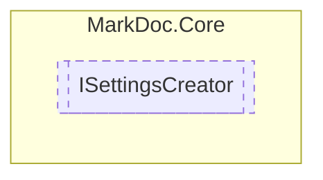

# ISettingsCreator `interface`

## Description
Interface for settings creators

## Diagram


## Members
### Methods
#### Public  methods
| Returns | Name |
| --- | --- |
| `T` | [`CreateSettings`](markdoccore-ISettingsCreator#createsettings)(`IReadOnlyDictionary`&lt;`string`, `string`&gt; data) |

## Details
### Summary
Interface for settings creators

### Methods
#### CreateSettings
```csharp
public abstract T CreateSettings<T>(IReadOnlyDictionary<string, string> data)
where T : ILibrarySettings
```
##### Arguments
| Type | Name | Description |
| --- | --- | --- |
| `IReadOnlyDictionary`&lt;`string`, `string`&gt; | data |   |

*Generated with* [*MarkDoc*](https://github.com/hailstorm75/MarkDoc.Core)
