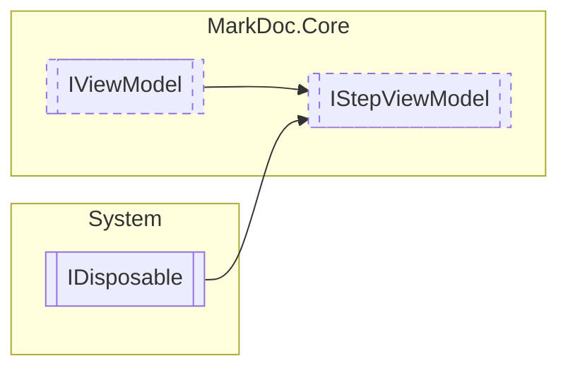

# IStepViewModel `interface`

## Description
Interface for view models of plugin steps

## Diagram


## Members
### Properties
#### Public  properties
| Type | Name | Methods |
| --- | --- | --- |
| `string` | [`Description`](markdoccore-IStepViewModel.md#description)<br>Step description | `get` |
| `string` | [`Id`](markdoccore-IStepViewModel.md#id)<br>Step view model Id | `get` |
| `bool` | [`IsValid`](markdoccore-IStepViewModel.md#isvalid)<br>Determines whether the step form is filled correctly | `get` |
| `string` | [`Title`](markdoccore-IStepViewModel.md#title)<br>Step name | `get` |

### Methods
#### Public  methods
| Returns | Name |
| --- | --- |
| `IReadOnlyDictionary` | [`GetSettings`](markdoccore-IStepViewModel.md#getsettings)()<br>Retrieves current settings |
| `ValueTask` | [`SetPreviousSettings`](markdoccore-IStepViewModel.md#setprevioussettings)(`IReadOnlyDictionary`&lt;`string`, `IReadOnlyDictionary`&gt; settings) |

## Details
### Summary
Interface for view models of plugin steps

### Inheritance
 - [
`IViewModel`
](./markdoccore-IViewModel.md)
 - `IDisposable`

### Methods
#### GetSettings
```csharp
public abstract IReadOnlyDictionary GetSettings()
```
##### Summary
Retrieves current settings

##### Returns
Current form settings

#### SetPreviousSettings
```csharp
public abstract ValueTask SetPreviousSettings(IReadOnlyDictionary<string, IReadOnlyDictionary> settings)
```
##### Arguments
| Type | Name | Description |
| --- | --- | --- |
| `IReadOnlyDictionary`&lt;`string`, `IReadOnlyDictionary`&gt; | settings |   |

### Properties
#### IsValid
```csharp
public abstract bool IsValid { get }
```
##### Summary
Determines whether the step form is filled correctly

#### Id
```csharp
public abstract string Id { get }
```
##### Summary
Step view model Id

##### Remarks
This Id is required for referencing previous settings

#### Title
```csharp
public abstract string Title { get }
```
##### Summary
Step name

#### Description
```csharp
public abstract string Description { get }
```
##### Summary
Step description

*Generated with* [*MarkDoc*](https://github.com/hailstorm75/MarkDoc.Core)
