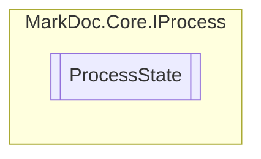

# ProcessState `enum`

## Description
Enumeration of possible states of a [IProcess](./markdoccore-IProcess)

## Diagram

## Details
### Summary
Enumeration of possible states of a [IProcess](./markdoccore-IProcess)

### Fields
#### Idle

#### Running

#### Success

#### Failure

#### Cancelled

*Generated with* [*MarkDoc*](https://github.com/hailstorm75/MarkDoc.Core)
