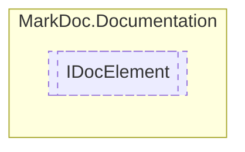

# IDocElement `interface`

## Description
Interface for element documentation

## Diagram


## Members
### Properties
#### Public  properties
| Type | Name | Methods |
| --- | --- | --- |
| [`IDocumentation`](./markdocdocumentation-IDocumentation.md) | [`Documentation`](markdocdocumentation-IDocElement.md#documentation)<br>Element documentation | `get` |
| `Lazy`&lt;`IReadOnlyDictionary`&gt; | [`Members`](markdocdocumentation-IDocElement.md#members)<br>Element members | `get` |
| `string` | [`Name`](markdocdocumentation-IDocElement.md#name)<br>Element name | `get` |

## Details
### Summary
Interface for element documentation

### Properties
#### Name
```csharp
public abstract string Name { get }
```
##### Summary
Element name

#### Documentation
```csharp
public abstract IDocumentation Documentation { get }
```
##### Summary
Element documentation

#### Members
```csharp
public abstract Lazy Members { get }
```
##### Summary
Element members

*Generated with* [*MarkDoc*](https://github.com/hailstorm75/MarkDoc.Core)
